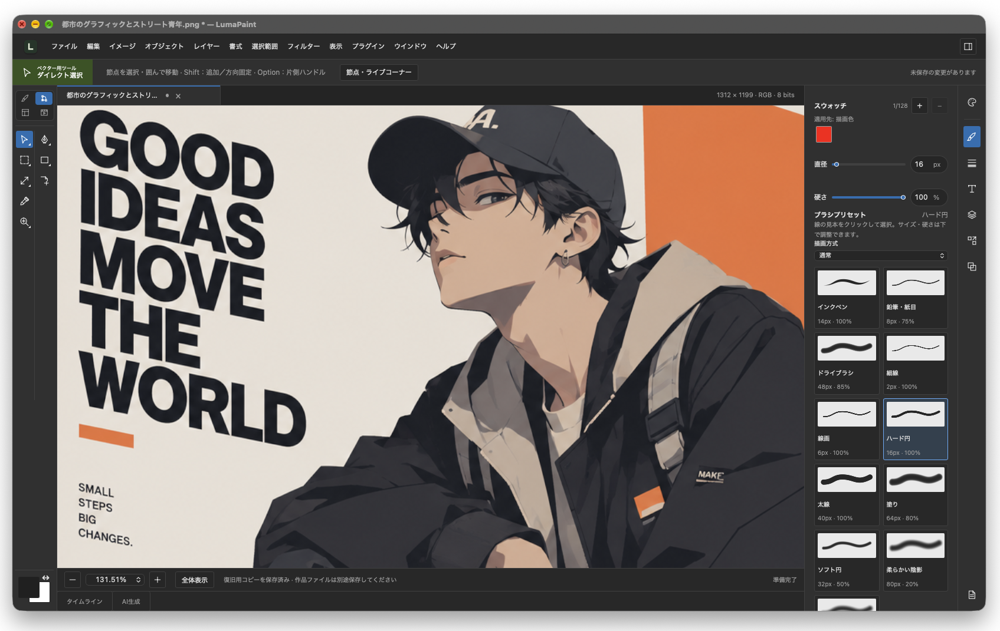

# LumaPaint



LumaPaint is a creative application for comics, illustration, AI generation, and animation, built around a shared non-destructive model.
The current implementation includes an editing workspace inspired by Adobe products and a basic brush for macOS.
You can draw on a 960 × 640 canvas, change the brush color and diameter, undo and redo individual strokes, and toggle the visibility of a single layer.
Projects can be saved, saved under a new name, and reopened as `.lumapaint` files. Automatic recovery copies allow you to restore work on the next launch. AI generation is not yet implemented.

Commands are organized into 11 top-level menus. The File menu contains Open, Save, and Save As; Edit contains Undo and Redo; View contains zoom controls; and Window contains panel controls. Unimplemented commands are disabled and marked as coming soon.
Click the application icon to the left of the File menu to open Settings. Use the General tab to change the language and the Appearance tab to change the theme.
Choose RGB or CMYK from Image → Color Mode. The selected mode is preserved in project files and recovery copies; additional modes can be added to the shared definitions.
The same Image menu offers 8-, 16-, and 32-bit depth settings, which are also preserved in project files and recovery copies.
Edit → Color Settings lets you choose sRGB, Display P3, or Adobe RGB for RGB documents, and Japan Color 2001 Coated for CMYK documents. Changing the color mode automatically selects a compatible default profile.
The properties area on the right provides Brush, Document, and Layers tabs. Reorder tabs by dragging them or pressing Alt + Left/Right Arrow. The active tab and tab order are saved locally.
Use File → Import SVG as Layer to add an SVG file. It is centered on the canvas with its aspect ratio preserved, and its visibility can be toggled independently in the Layers panel. The original SVG data is preserved in project files and recovery copies.

On macOS, basic SVG shapes are rendered with Google Skia, while complex SVG content is rendered with resvg. A path-operation foundation has also been added for vector editing. The control-point editing UI is planned for a later implementation. See [vector engine scope and build requirements](docs/vector-engine.md).

External format support is tracked in the [Adobe and open-format compatibility design and matrix](docs/format-compatibility.md). An independent Rust library provides the foundation for reading opaque RGB8 composite images from PSD files. PSD import through the GUI, editable layer compatibility, and PSD export are not yet supported.

## Development environment (macOS first)

- Node.js 26.10.0, pinned in `.nvmrc`, and npm
- Rust stable, including Cargo, rustfmt, and Clippy
- Xcode Command Line Tools (`xcode-select --install`)
- macOS 12 or later. Validation starts on the development Mac, with supported configurations verified incrementally.

```sh
nvm use # If you use nvm
npm ci
npm run tauri dev
```

For a UI-only preview, run `npm run dev`. The browser does not connect to the Rust core, and the UI displays a notice explaining this limitation.

```sh
npm run build
npm run check:rust
npm run test:rust
npm run tauri build -- --bundles app
```

The macOS application is generated at `target/release/bundle/macos/LumaPaint.app`.
To generate a development application, run `npm run tauri build -- --debug --bundles app`.
Its output path is `target/debug/bundle/macos/LumaPaint.app`.
Distribution signing and notarization, the final application icon, and the final application identifier are planned for later.

## Project structure

```text
src/                        React + TypeScript: UI, translations, and IPC
src-tauri/                  Tauri 2: desktop startup and OS integration
crates/lumapaint-core/       Rust core independent of the OS, UI, and renderer
crates/lumapaint-formats/    Native/SVG/PSD I/O, shared exporter, compatibility reports
crates/lumapaint-svg/        Replaceable adapter for SVG geometry resolution and editing
crates/lumapaint-renderer/   Cross-platform wgpu rendering and WGSL shaders
docs/                       Design, development guidelines, and roadmap
```

[Document and external engine boundaries](docs/document-boundaries.md) describes dependency direction and how runtime adapters connect to the core.

On macOS, Rust, wgpu, and Metal render directly into an NSView child of WKWebView.
Only necessary frames are rendered in response to zooming, fitting the canvas, window resizing, and appearance changes.
Zoom is relative to the fit-to-view scale, which is treated as 100%. GPU information is available in the tooltip on the ready indicator.
Browsers and other operating systems display an unsupported-platform notice and disable zoom controls.
UI language (English, Japanese, or Simplified Chinese) and appearance (System, Light, or Dark) are saved locally.
API keys are not currently handled. Drawing data is kept in memory and written to a file when saved.

## Other platforms

The architecture supports sharing code with Windows and Linux, and CI includes compilation checks on all three operating systems.
Runtime behavior on physical Windows and Linux machines, as well as package distribution for those platforms, has not yet been verified. OS-specific functionality is confined to the Tauri layer.
Windows requires the MSVC build tools and WebView2. Linux requires dependency packages such as WebKitGTK.
See the [Tauri prerequisites](https://v2.tauri.app/start/prerequisites/) for details.

[Development guidelines](docs/development.md) / [Roadmap](docs/roadmap.md) / [Design specification](docs/LumaPaint設計仕様書.md)

## Saving projects

Use Save, Save As, and Open from the top menu. Their shortcuts are ⌘S, ⇧⌘S, and ⌘O.
Project files use versioned JSON and preserve stroke coordinates, colors, diameters, and layer visibility.
Discarded undo branches and UI preferences are not included in project files. See the [project format](docs/project-format.md) for details.

## Recovering work

After a stroke is committed or Undo/Redo is performed, a recovery copy is saved in the background separately from the project file.
After an unexpected shutdown, choose Restore Previous Work at startup. Save the recovered project manually.
Uncommitted strokes and changes interrupted during writing may not be recoverable. See the [recovery specification](docs/recovery.md).

[Large scenes and rendering caches](docs/large-scene-rendering.md) describes the design for processing only changed objects, the migration path toward 100,000 and 1,000,000 objects, and the measurement criteria for 60/120 fps.
