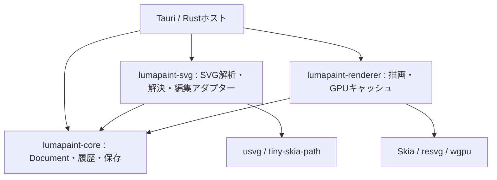

# Document Modelと外部エンジンの境界

`lumapaint-core`はLumaPaint独自のDocument、VectorObject、線・ベジェ形状、処理グラフ、タイル、検証、履歴、保存形式を所有する。Skia、usvg、resvg、tiny-skia、wgpu、フォントデータベース、Tauriには直接・間接とも依存しない。`scripts/check-core-boundary.py`で通常依存の全経路を検査し、CIで再導入を防ぐ。



依存矢印は呼び出し元から依存先を示す。coreからSVGアダプター・rendererへ向かう依存はない。

## SVG編集の契約

coreの`SvgGeometryBackend`が、元SVG・レイヤーID・文書寸法から独自の`VectorObject`を取得し、`SvgEdit`の配列を元SVGへ反映する境界を定義する。境界を越える値は文字列、寸法、ID、LumaPaintの独自型だけ。usvgのTree・Path・Group、tiny-skiaのPath、XMLソース位置、フォント、解析キャッシュは`lumapaint-svg`内部に閉じ込める。

Documentは元XMLを保持し、SVGアダプターの描画ツリーを正本にしない。アダプターは入力を変更せず、変更後の完全なSVGを返す。Documentが検証、変更の一括確定、Undo/Redo、保存を担当する。インスタンスの独立化やCSSの解決はアダプターの責務。

`Document::set_svg_geometry_backend`で各Documentへ実行時サービスを接続する。グローバル登録は使わず、別Documentでは異なる実装を使える。DocumentのクローンはサービスへのArcを共有するため、プレビューとUndoでも同じ実装を使う。サービスは文書・ウインドウ・選択の状態を所有しない。

保存JSONにはサービスを含めない。`Document::default`と`Document::decode`はアダプターなしで動作し、SVGの保持・保存を行える。読み込みSVG内部のダイレクト編集を使うホストは、読み込み後に`lumapaint_svg::attach(&mut document)`を実行する。macOSホストは初期文書と文書のアクティブ化時に接続する。接続がない場合、読み込みSVGの編集対象は空になり、内部編集のプレビューはエラーを返す。独自ベクターの編集・保存にはアダプターは不要。

## 独立性の範囲

VectorPathは現在もSVG互換のd文字列とFillRuleを持ち、coreはXML検証にroxmltree、パス構文・幾何処理にsvgtypesを使う。この外部形式・構文への依存は残るが、描画エンジンの型や動作への依存ではない。Skiaの交換でDocumentや保存形式を変更する必要はない。

既存の`VectorPathEngine`もcoreで定義され、rendererの`SkiaPathEngine`がパス演算を実装する。今回SVG編集も同じ依存方向へ揃えた。SVGと描画側のusvgバージョンは互換のため揃えているが、その選択をDocument Modelへ持ち込まない。

## 検証

- coreだけで、異なる実装の接続、文書ごとの独立性、クローン、保存形式の不変、アダプター未接続の再読込、失敗時の文書・履歴不変を検証する。
- SVGアダプター側で、形状・CSS・use、元XMLの保持、識別子、保存・再読込、複数節点編集、Undo/Redoを検証する。
- renderer側で、アダプターの公開契約を通したSVG変換前後の描画ピクセルを比較する。

```sh
python3 scripts/check-core-boundary.py --offline
cargo test -p lumapaint-core --offline
cargo test -p lumapaint-svg --offline
cargo test --workspace --offline
```
